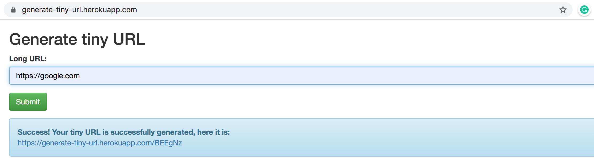

# CI/CD GitHub Actions pipeline to deploy Generate-Tiny-URL Flask on Heroku

Hello,

Thank you for being here.

In this repository, you have a Flask application for tiny URL generation.
The application itself is pretty basic, and the main interest
here is a fully automated GitHub Actions pipeline for the deployment on  Heroku:

- Build dockerized Flask application.

- Boot Flask container and fail if it's not running.

- GateKeeper: run test suite on booted container with application context 
and fail if tests are not 100%.

- Tag the container following Heroku naming conventions.

- Login to Heroku and Heroku registry and push the tagged image.

- Deploy pushed docker image on Heroku.

The result looks like this and could be checked live [here, on Heroku](https://generate-tiny-url.herokuapp.com/).

